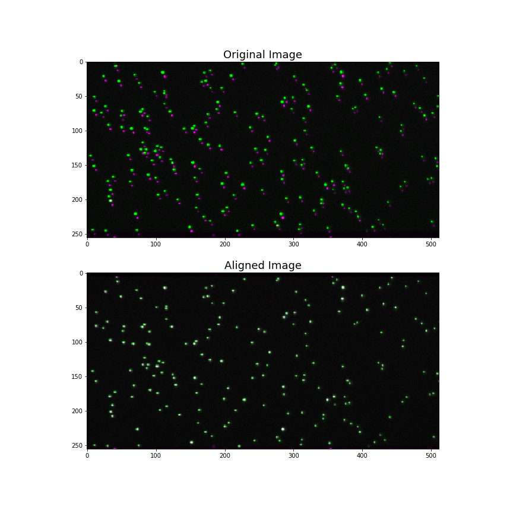

.. toctree::
   :maxdepth: 2
   :caption: Contents:

Alignment
=========

aligning images
~~~~~~~~~~~~~~~

The `smtools.algnment` module is designed to align images that were split
into separate channels during data collection. It relies on using
fluorescent particles that appear in both channels. To see how it works
see our walkthrough `here`_ . Also `finding maxima`_ and `fitting gaussians`_.

.. _here: https://github.com/ReddingLab/Learning/blob/master/image-analysis-basics/4__Image-alignment-with-toolbox.ipynb
.. _finding maxima: https://github.com/ReddingLab/Learning/blob/master/image-analysis-basics/2__finding-local-maxima.ipynb
.. _fitting gaussians: https://github.com/ReddingLab/Learning/blob/master/image-analysis-basics/3__fitting-gaussians.ipynb

.. code-block:: python

    import smtools.testdata as test
    import smtools.alignment as al
    import matplotlib.pyplot as plt
    dx, dy, params = al.inspect_global_fit(test.image_stack(), showplot=False)
    im = test.image_stack()[0]
    im_old = al.overlay(im)
    im_adj_image = al.align_by_offset(im,dx,dy)
    im_new = al.overlay(im_adj_image)
    fig = plt.figure(figsize=(12,12))
    ax1 = fig.add_subplot(211)
    ax2 = fig.add_subplot(212,sharex=ax1)
    ax1.set_title('Original Image', fontsize = "18")
    ax2.set_title('Aligned Image', fontsize = "18")
    ax1.imshow(im_old)
    ax2.imshow(im_new)
    plt.show()

Alignment module
~~~~~~~~~~~~~~~~~~~~
.. automodule:: alignment
   :members: