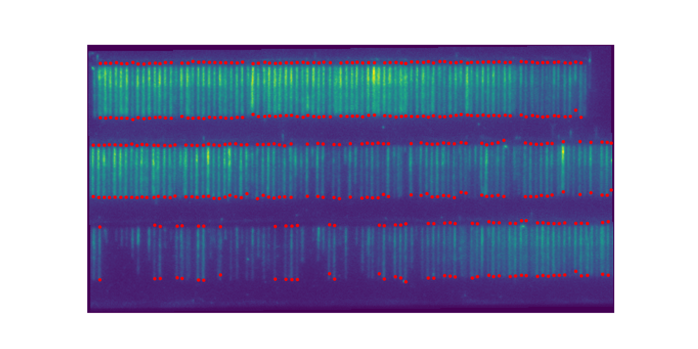

.. toctree::
   :maxdepth: 2
   :caption: Contents:

curtains
========

Detecting DNA curtains
~~~~~~~~~~~~~~~~~~~~~~

The `smtools.curtains` module is designed to locate, and fit the intensity
profile of individual DNA molecules within a DNA curtain. For a description
of how it works see our walkthroughs `part 1`_, `part 2`_, and `part 3`_.

.. _part 1: https://github.com/ReddingLab/Learning/blob/master/image-analysis-basics/5__DNA_curtain_finder_1.ipynb
.. _part 2: https://github.com/ReddingLab/Learning/blob/master/image-analysis-basics/6__DNA_curtain_finder_2.ipynb
.. _part 3: https://github.com/ReddingLab/Learning/blob/master/image-analysis-basics/7__DNA_curtain_finder_3.ipynb

.. code-block:: python

    import smtools.curtains as cs
    import smtools.alignment as al
    from scipy.ndimage.interpolation import rotate
    import matplotlib.pyplot as plt
    import smtools.testdata as test
    im = test.test_curtain()
    ch1,ch2 = al.im_split(im)
    angle = cs.find_rotang(ch2)
    rotated_ch2 = rotate(ch2,angle)
    bounds, mask = cs.find_curtain(rotated_ch2)
    strands = cs.find_DNA(rotated_ch2,bounds)
    DNAs = cs.fit_DNA(rotated_ch2, strands)
    fig = plt.figure(figsize=(5,10))
    plt.axis('off')
    plt.imshow(rotated_ch2)
    for x0,x1,y in DNAs:
        plt.plot([x0,x1],[y,y],"r.", markersize = 5)
    plt.show()

The curtains module
~~~~~~~~~~~~~~~~~~~
.. automodule:: curtains
   :members:

.. autoclass:: Curtain
   :members:
